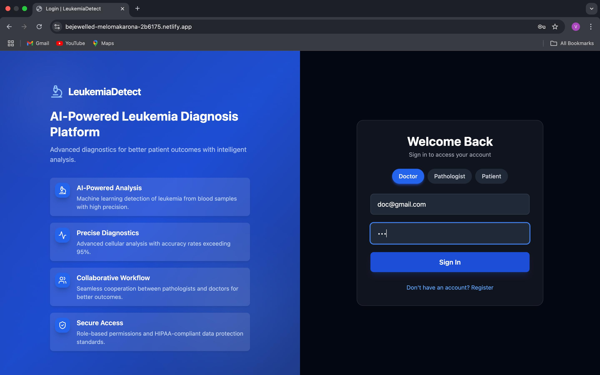
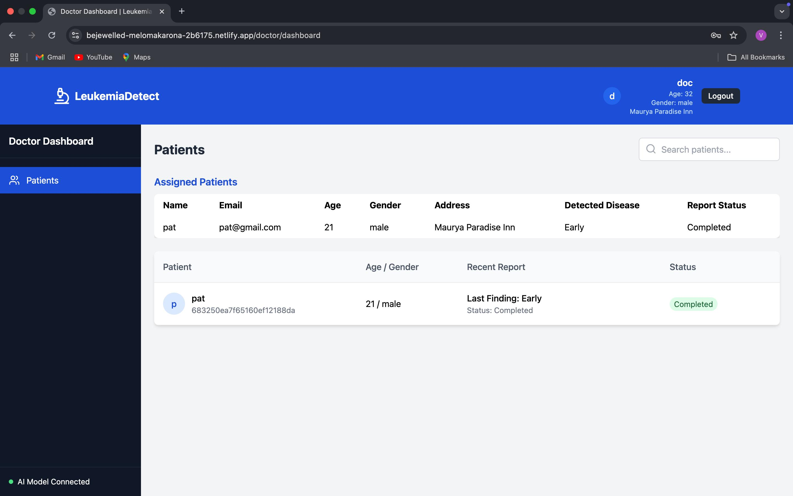
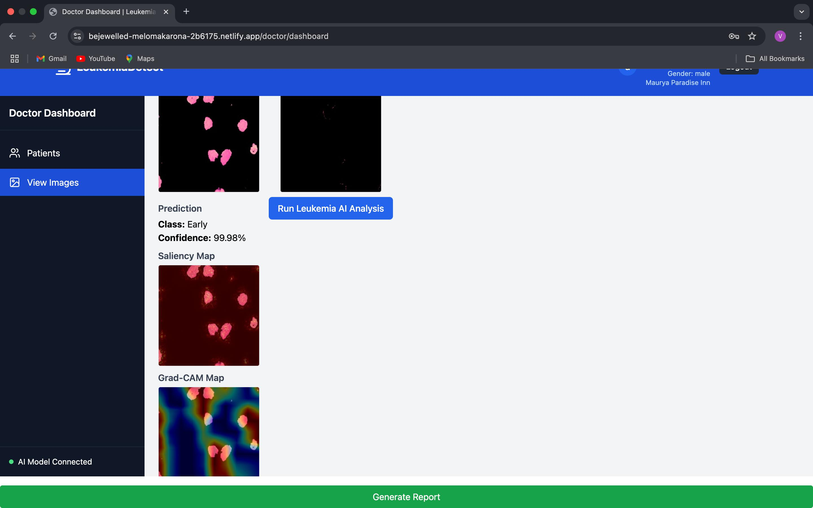
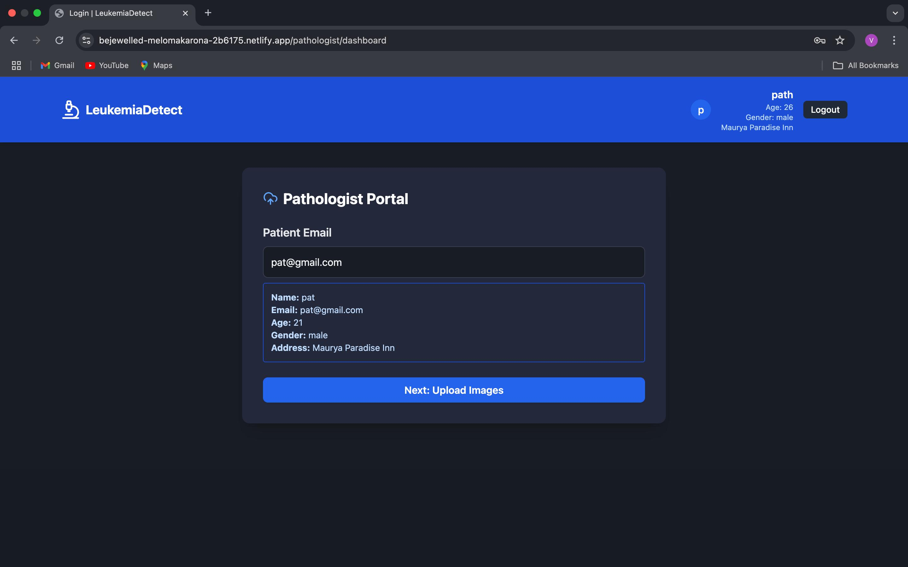
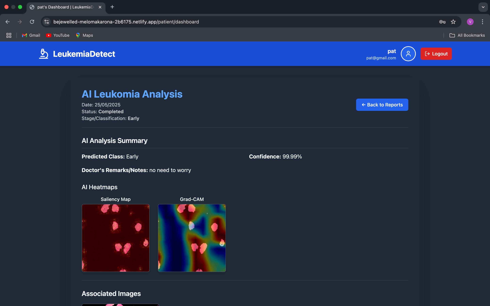

# 🧬 XAI-Powered Leukemia Detection for Rural India

## 🌟 Mission

In India’s rural heartlands, millions still struggle to access timely cancer diagnostics due to a shortage of skilled pathologists and oncologists. Our mission is to *bridge this diagnostic divide* using advanced AI and Explainable AI (XAI) technologies.

We aim to *empower local clinics, health workers, and small pathology labs* with a *cloud-based leukemia detection system* that delivers *fast, accurate, and interpretable results* — reducing diagnostic time from hours to minutes and eliminating the need for expensive, inaccessible lab infrastructure.

> ⚕ *“We’re not just building a tool — we’re building a lifeline for 500 million people where doctors don’t reach, and cancer often wins by default.”*

---

## 🚀 Overview

Leukemia is a life-threatening blood cancer that, if diagnosed early, has over a 90% survival rate. However, *late diagnosis, manual errors, and lack of diagnostic infrastructure* contribute to high fatality rates — especially in underserved regions.

> 📌 In 2024, an estimated *474,000 people globally* will be diagnosed with leukemia (source: WHO).  
> 📌 In India, over *25,000 children are diagnosed annually* with leukemia (source: National Institute of Health).

We present a *CNN + XAI (Grad-CAM + Saliency Map) based pathology imaging platform* trained on the globally recognized *ALL-IDB dataset*, with a **97% accuracy rate**. The system not only predicts the leukemia stage (Beginner, Early, Pre-pro) but also provides **clinically interpretable visual heatmaps**, ensuring trust and transparency for medical professionals.

---

## 🖼️ Interface Screenshots

### 1. Login Page  
  
*Secure role-based login for doctors, pathologists, and patients.*

### 2. Doctor Dashboard  
  
*View reports uploaded by Pathologist.*

  
AI analysis with heatmaps, and clinical notes.

### 3. Pathologist Dashboard  
  
*Upload blood smear images and monitor AI processing status.*

### 4. Patient Dashboard  
  
*View diagnosis reports, leukemia stage, and download reports.*

---

## 🧠 Key Features

- 🔍 *High Accuracy Detection* — 97% accuracy using Convolutional Neural Networks.
- 🌈 *Explainability with XAI* — Visualize key image regions influencing diagnosis using Grad-CAM and Saliency Maps.
- 🌐 *Cloud-Hosted Platform* — Accessible in rural areas with basic internet connectivity.
- 👨‍⚕👩‍🔬👨‍👩‍👧 *Interfaces for Doctors, Pathologists & Patients* — Enabling collaborative and efficient diagnostics.
- 💸 *Cost Reduction* — Cut diagnosis costs by up to 70% (no travel, fewer tests, faster results).

---

## 🛠 Tech Stack

- *🧩 Model:* Convolutional Neural Network (CNN), Explainable AI (Grad-CAM, Saliency Maps)
- *🖥 Frontend:* React.js, Tailwind CSS
- *🔧 Backend:* Node.js, Express.js, JavaScript, JWT (Authentication)
- *☁ Deployment:* Netlify (Frontend), Render (Backend)  
  🔗 [Access the App](https://bejewelled-melomakarona-2b6175.netlify.app/)

---

## 🔍 How Explainable AI Works

To foster trust in our model, especially among doctors and healthcare workers, we use:

### ✅ Grad-CAM (Gradient-weighted Class Activation Mapping)
Highlights key regions in an image that influenced the classification (e.g., abnormal nuclei, chromatin).

### ✅ Saliency Maps
Show pixel-level sensitivity by calculating gradient-based importance for each image pixel.

These tools provide *transparent decision-making, **clinical validation, and help meet **regulatory explainability requirements*.

---

## 📊 Results

- ✅ *97% Accuracy* on ALL-IDB dataset
- 🔁 *Cross-validated*
- 📊 *Confusion matrix* verified
- 📌 Visual heatmaps allow *doctors to interpret and verify AI decisions*

---

## 🏥 Real-World Inspiration

Leading institutions worldwide are adopting XAI in diagnostics:

- *Tata Memorial (India)* – AI oncology research
- *Apollo Hospitals* – AI pathology pilots
- *Stanford CheXNet* – Pneumonia detection using Grad-CAM
- *Mayo Clinic, NHS, Aravind Eye Hospital* – AI and XAI in real-time clinical use

---

## 🌍 Impact on Rural Healthcare

- 📉 *Reduced diagnosis time* (from 2–4 hours to minutes)
- 👩‍⚕ *24/7 availability*, unlike human pathologists
- 🚫 *No need for expensive labs or trained oncologists*
- 🏥 *Accessible via any internet-connected device*

---

## 🔗 The Chain of Collaboration

By integrating:
- *Doctors* (diagnosis validation)
- *Pathology labs* (sample upload)
- *Patients* (report access)

We create a *collaborative, transparent, and faster diagnostic ecosystem* — far superior to the conventional disconnected process.

---

## 📌 Future Scope

- Multi-cancer detection models
- Integration with hospital information systems (HIS)
- Multilingual support for rural health workers
- Offline edge-device deployment for no-internet zones

---

> “Bridging the diagnostic divide — from metro labs to village clinics.”
# readm
